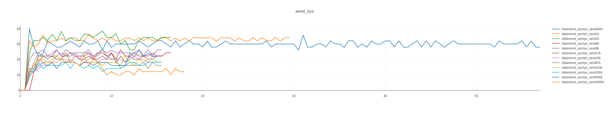
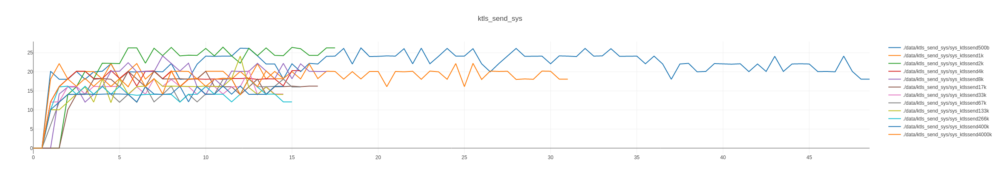
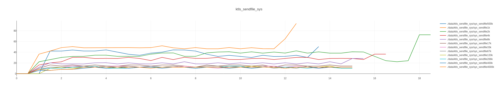

# ktls_sys_stats

A comparison of `send` vs `ktls+send` vs `ktls+sendfile`. An interactive html graph can be found in the data/plots directory.

[interactive html send_sys](./data/plots/plotly_send_sys.html)

[interactive html ktls_send_sys](./data/plots/plotly_ktls_send_sys.html)

[interactive html ktls_sendfile_sys](./data/plots/plotly_ktls_sendfile_sys.html)

## TODO
graph the network thruput
