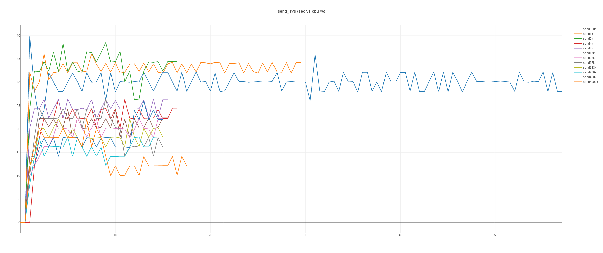
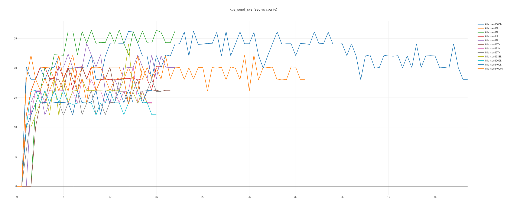
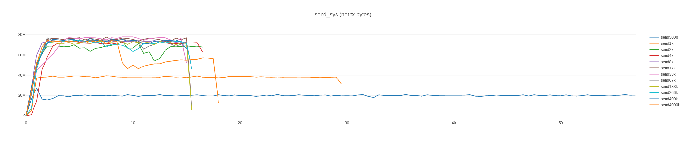

# ktls_sys_stats

A comparison of `send` vs `ktls+send` vs `ktls+sendfile`. An interactive html graph can be found in the data/plots/(cpu,net_tx) directory.

## CPU % by payload
[interactive html send_sys](./data/plots/cpu/by_payload.html)

## Network TX by payload
[interactive html send_sys](./data/plots/net_tx/by_payload.html)

## CPU % data
[interactive html send_sys](./data/plots/cpu/plotly_send_sys.html)

[interactive html ktls_send_sys](./data/plots/cpu/plotly_ktls_send_sys.html)

[interactive html ktls_sendfile_sys](./data/plots/cpu/plotly_ktls_sendfile_sys.html)

## Network TX data
[interactive html send_sys](./data/plots/net_tx/plotly_send_sys.html)

[interactive html ktls_send_sys](./data/plots/net_tx/plotly_ktls_send_sys.html)

[interactive html ktls_sendfile_sys](./data/plots/net_tx/plotly_ktls_sendfile_sys.html)

